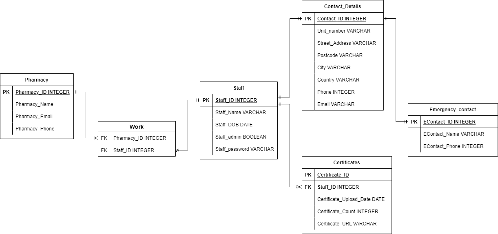

# Guided Side App 

## Purpose of Side App

I have been working in a pharmacy and as part of the current government regulations, any customers entering the pharmacy need to sign into the premises and show their vaccination certificate where applicable. Vaccinations for staff are not enforced yet in NSW (unlike in other states) however, I thought in preparation of enforcing staff to have proof of their vaccination certificate prior to starting work, I could create a web application that allows staff to directly upload their certificate for administration to view without having to check staff vaccinations before every shift.

The staff should be able to do the following:
- Sign up and set password
- Log in
- Add/edit/remove/view their details
    - Name
    - Date of Birth
    - Password
- Add/edit/remove/view their contact details
    - Address
    - Phone
    - Email
    - Emergency Contacts
- Add/edit/remove/view their certificates
    - Current and Previous certicicates uploaded
- Add/edit/remove/view the pharmacies they are working in
    - Current and Previous certicicates uploaded

- Make their profile private from everyone
- Enable Two Factor Authentication

The admin should be able to do the following:
- log in
- add/edit/reset password* staff
- add/edit/remove their certificate
- add/edit/remove their profile picture 
- add/edit/remove their details
- add/edit/remove pharmacy details
- make their profile private 

## Pages and Functionality

| Pages | Functionality |
| :-----: | :------------  |
| Home page | Home serves as the landing page that will give a brief overview of the purpose of the website application. Staff can also select from this page to sign up or log in. |
| Sign up page | Staff can sign up as a STAFF.  | 
| Log in page | Once staff create an account, they are considered STAFF. STAFF can then log in on this page using their credentials. |
| Staff details page | ADMIN and STAFF can VIEW their details and any certificates uploaded | 
| Edit staff details page | Staff can EDIT their details and upload their certificates. |
| Pharmacy details | Staff can VIEW the details of their pharmacy selected | 
| Edit pharmacy details | ADMIN has the ability to EDIT the pharmacy details | 
| Staff index page | ADMIN can VIEW a list of staff |
| Edit staff index page | ADMIN has the ability to REMOVE staff. |
| Pharmacy index page | ADMIN can VIEW list of pharmacies | 
| Edit Pharmacy index page | ADMIN can ADD/REMOVE pharmacies from database. |

## Entity Relationship Diagram of App Data Model 



## Validators

Adding the following python packages to the schemas:

```python
from marshmellow import validate
```

| Table | Field | Validator | 
| ----- | ----- | --------- |
| Pharmacy | pharmacy_name | validate=validate.Length(min=1) |
| Pharmacy | pharmacy_email | validate=validate.Email() | 
| Pharmacy | pharmacy_phone | validate=validate.Length(min=10) |
| Staff | staff_name | validate=validate.Length(min=1) | 
| Contact_details | street_address | validate=validate.Length(min=1) |
| Contact_details | postcode | validate=validate.Length(min=4) |
| Contact_details | city | validate=validate.Length(min=1) | 
| Contact_details | country | validate=validate.Length(min=1) |
| Contact_details | phone | validate=validate.Length(min=10) | 
| Contact_details | email | validate=validate.Email() |
| Emergency_contact | name | validate=validate.Length(min=1) |
| Emergency_contact | phone | validate=validate.Length(min=10) | 
| Certificates | certificate_URL | validate=validate.URL() |

## Authentication, Authorisation and Object-Relational Mapping

Flask is a framework for Python that allows us to build web applications to be reliable, scalable and maintainable. One way for our applications to communicate with a database is using SQL, which uses Psychopg that allows Flask to communicate with the database. However, using raw queries such as SQL makes our database vulnerable to injection attacks. These are also known as SQL injections or SQLi. Well-versed attackers can add or "inject" unstructured query language into an SQL command, treiggering unwanted ramifications. Hence, using an Object-Relational Mapping (ORM) package that maps objects and actions (create, read, update, delete AKA CRUD) into SQL. This will allow mapping of our database tables to our objects, creating a CRUD resource for our objects. Validators further improve the security of the web app, as it can verify that the input the staff provided is valid, thus mitigating some of the common security concerns of SQLi.        

My application will use a Basic Authentication mechanism to protect user privacy. It will consists of a username and password. The web application will apply a verification package using  an installed package from Flask called "Flask-Login". Since this involves sensitive data, cryptography will be used to protect it. A secret key:value pair will be set in the application for encryption/decryption purposes. The secret key will be set as an environment variable and added to the configuration. Then an object is created to manage any login attempts from staff.  This initialisation is operated using the LoginManager of flask_login. We are going to be using the "Staff" model that has a table in our database to store user info. A Schema is then utilised to create instances from key:value pairs and vice-versa. Finally, Templates will be used to as our endpoints. To combine our Model, Schema and Templates, we will setup Controllers to create views.

Within the controller, if a user has signed in successfully, a user instance will return based on the session information in the user's browser cookie. However, the page will be redirected to the login page for any staff trying to access pages that require authorisation. By applying the ```@login_required``` decorator under the staff_details views, the application will only display the staff's details including any certificates they have uploaded to the staff currently logged on, thereby protecting the privacy of all staff. Otherwise, staff will be redirected to the log in page also.

## Professional, Ethical and Legal Obligations

More recently, there has been news on the internet of a "Log4j" vulnerability affecting some of the world's most popular applications and services to attack. The bug is of a vulnerability in an open source Apache logging library and attackers have exploited the flaw to conduct malicious activities. Some of these include installing cryptominers on vulnerable systems, stealing system credentials and stealing data, according to wired.com. In relation to my own web application, there are many similarities to our professional, ethical and legal obligation that can be applied to the above.

Professionally speaking, companies who have had their systems compromised such as this, have a professional obligation to report to their clients who are using their web services. However, more likely than not, those clients would also have data on clients of their own. As an example to the above situation, one of the companies affected by the Log4j vulnerability is UKG. UKG is a HR Solutions company that offers payroll services to other companies. Company A, who is serviced by UKG, would then also have their services be affected, depending on what services they use with UKG. As a result, Company A's data systems are compromised and staff details from Company A would also be compromised. Hence, Company A would also have a professional obligation to be explicit about any ongoing maintenance issues, such as these, that is reportable to their employees. Likewise, my current application uses Flask as a web API framework. Similar to "Log4j", Flask is an open sourced software used by many. In the event that something similar were to happen, it would be our professional obligation as developers to not only contact the Company who is using our service but also their employees who could potentially be affected.

Furthermore, this extends to our ethical and legal obligation. In most cases, highly confidential data are involved. In relation to Log4j, staff details including full name, date of birth, and contact details may be stored on web applications used by Company A. This would inevitability lead to the risk of exposing confidential data to attackers and lead to privacy conerns. Although, Company A has not intently shared confidential information and this was the result of using a third-party software service, they do have an ethical obligation to inform their employees of any breaches to their employees' data. Likewise, my pharmacy side app, would have an ethical and legal obligation to inform any staff users of such data breaches, however serious the situation may be.   

# NOTES

google one to one relationships in flask


